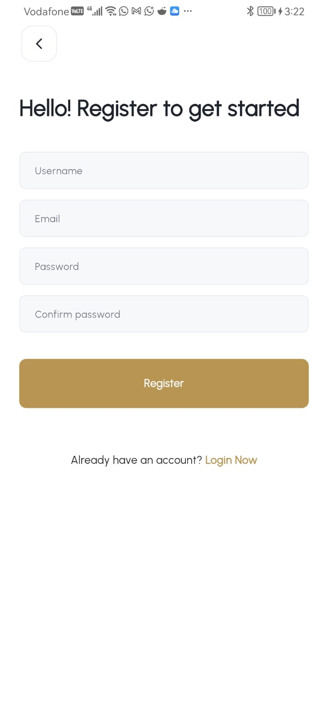
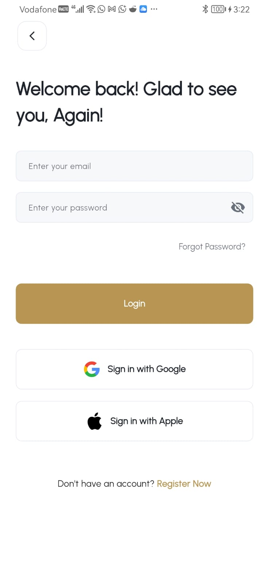
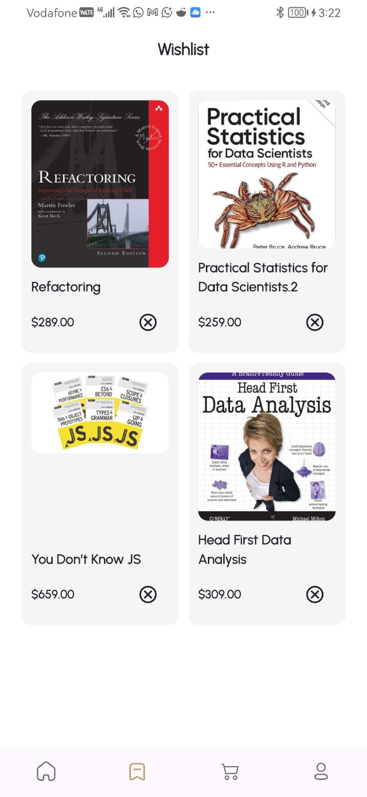
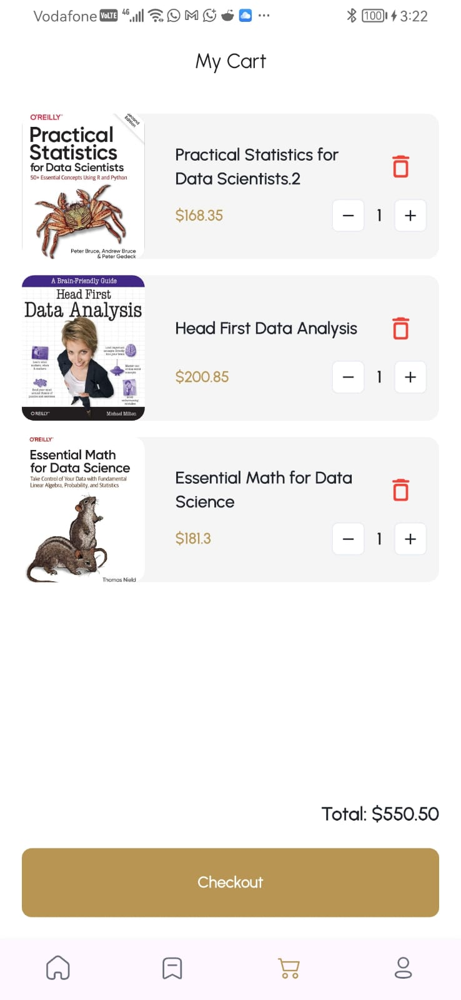
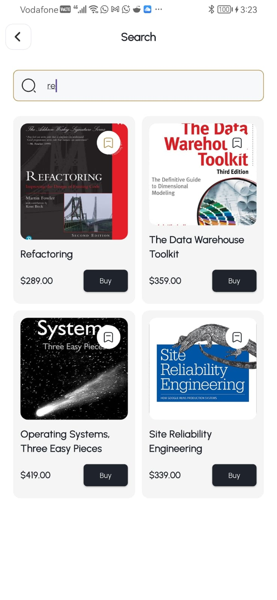
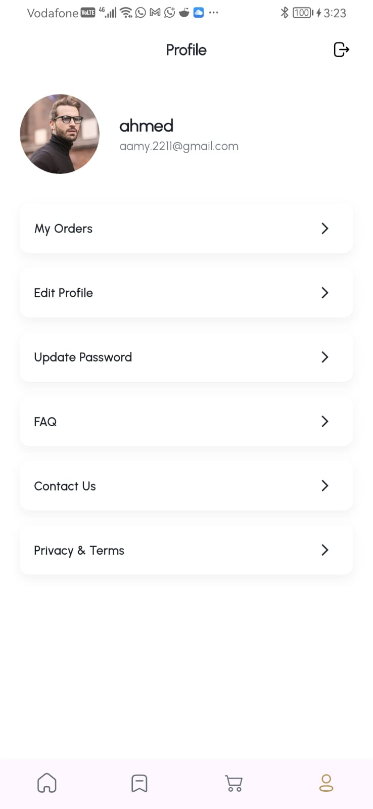
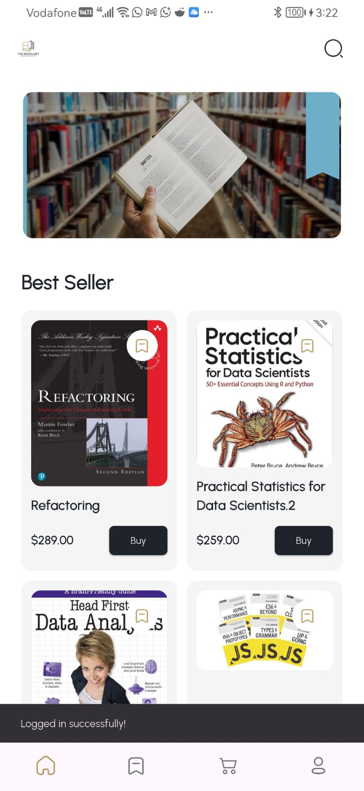
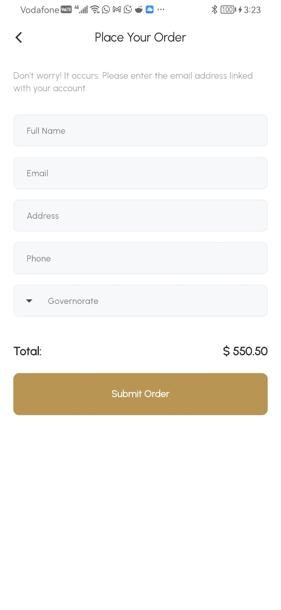
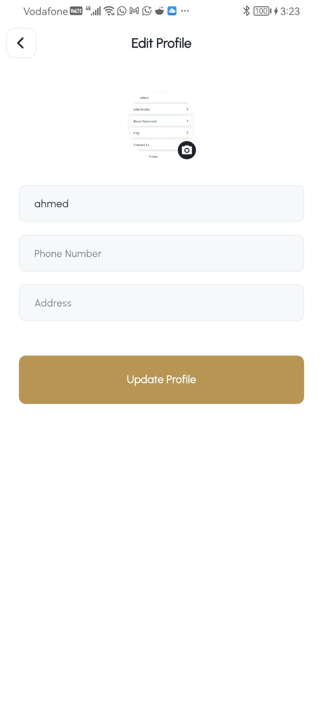

# 📚 Bookia - The Premium Bookstore App

  
<b>Live Demo Walkthrough</b>

  

Welcome to **Bookia**, a fully-featured, beautifully designed cross-platform bookstore application built with Flutter. This project is a pixel-perfect implementation of a 20-page professional Figma design.

## 🌟 Key Highlights
- **Full Figma Implementation:** 20+ screens including Auth, Home, Search, Cart, Checkout, and Profile.
- **Pristine UI/UX:** Utilizing `flutter_screenutil` for flawless responsiveness across all devices.
- **Global State Management:** Real-time synchronized cart and wishlist state via `Cubit`.
- **Cached Sessions:** Secure token handling with dynamic Splash routing.
- **Production Ready:** Optimized Release build with adaptive launcher icons.

## 📸 Screenshots (Full Flow)

  
  
  
  

  
  
  
  

  
  
  
  

## 🚀 Download & Run
You can download the production-ready Release APK directly from this repository.

**📥 [Download Release APK](docs/apk/bookia-release.apk)**

---

## 👨‍💻 Credits & Acknowledgments
This project was conceptualized and developed by **Ahmed Gaafar**, proudly sponsored and supported by **EraaSoft**.

I would like to express my sincere gratitude and appreciation to my instructors for their invaluable guidance and support:
- **Eng. Sayed Abdul-Aziz**: For the high-quality teaching, guidance, and the foundational knowledge shared throughout the development.
- **Eng. Abdalrahman Nasser**: For the constant supervision, follow-up, and technical oversight that helped me achieve this "perfect" result.

---
*Built with ❤️ in Flutter.*
