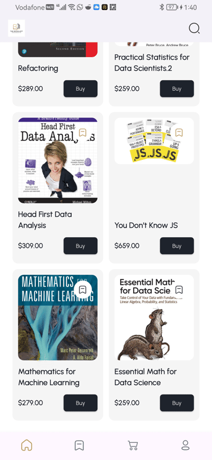
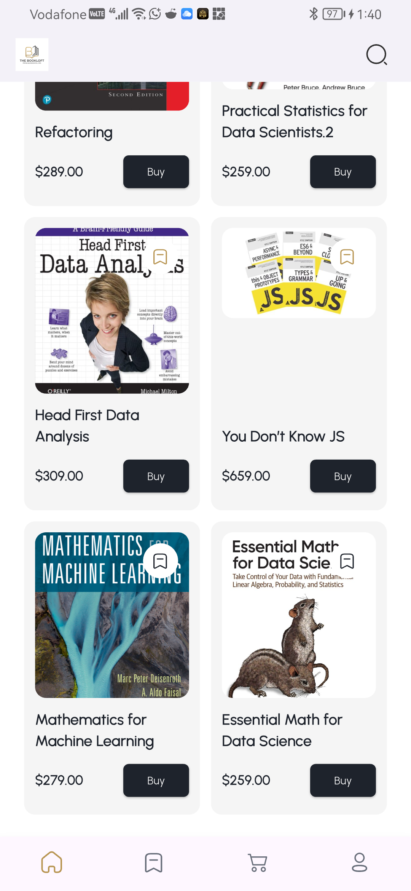

# 📚 Bookia - The Premium Bookstore App

  

Welcome to **Bookia**, a fully-featured, beautifully designed cross-platform bookstore application built with Flutter.

## 🌟 Features
- **Pristine UI/UX:** Faithfully implements the gorgeous Figma design, utilizing `flutter_screenutil` for pixel-perfect responsiveness.
- **Dynamic API Integration:** Communicates with remote backends seamlessly using `Dio` with robust generic error handling.
- **Global State Management:** Features synchronized cart and wishlist state via `Cubit` (Bloc pattern) ensuring badges and icons update globally across all screens in an instant.
- **Cached Authentication:** Built-in Token and Session caching. The Splash screen dynamically routes the user, skipping the Welcome loop if already verified.
- **Adaptive Launcher Icons:** Automatically adopts iOS and Android native radius restrictions with high-quality adaptive background rendering.

## 📸 Screenshots

  
  
  
  
  
  

## 🚀 Release Information
A highly optimized, tree-shaken Release APK has been fully built.

**Download the Release APK:**
👉 `build/app/outputs/flutter-apk/app-release.apk`

---

## 👨‍💻 Credits & Acknowledgments
This project was conceptualized and developed by **Ahmed Gaafar**, proudly sponsored and supported by **EraaSoft**.

I would like to express my sincere gratitude and appreciation to my instructors for their invaluable guidance and support:
- **Eng. Sayed Abdul-Aziz**: For the high-quality teaching, guidance, and the foundational knowledge shared throughout the development.
- **Eng. Abdalrahman Nasser**: For the constant supervision, follow-up, and technical oversight that helped me achieve this "perfect" result.

---
*Built with ❤️ in Flutter.*
